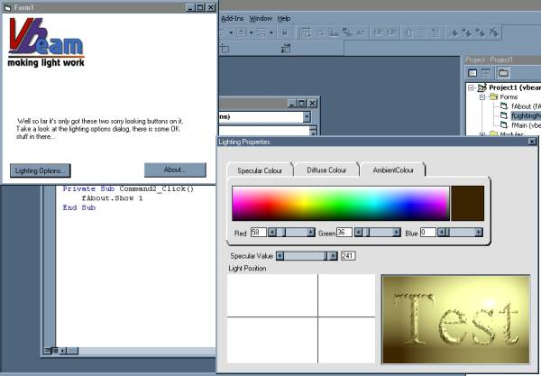



## Vbeam \- making light work\.\.\.

### Description

This is the second incarnation of Blade Pro Wannabe, being the ongoing quest to create a useful open source project in VB for creating some of the neat 2d lighting effects seen in such programs as Photoshop (lighting tool), Corel's Paint program and graphics plugin utilities like Flaming Pear's Super Blade Pro.

- adjustable lighting colors for abmient, diffuse and specualar elements of light.

- adjust the ammount of glare or shine.

Lot's of kudos go out to the many sources from which this is derived, including :

Daniel Davies

http://www.daniel_davies.pwp.blueyonder.co.uk

daniel.davies@blueyonder.co.uk

For his delphi implementaion of a bumpmapper.

Mike Sutton of EDIAS software

WWW: Http://EDais.earlsoft.co.uk/

Work E-Mail: EDais@btclick.com

Other E-Mail: Mike.Sutton@btclick.com

For a ton of advice over a long time.

Kath Rock software - for the color blend algorithm

Robert Rayment - For a lot of help on lot's of things, not all included here.

plus many others from all over the WWW...

This project is now a joint effort with Scythe, so stay tuned for more information ...

Any votes, feedback, suggestions, bug reports, criticisms (constructive) welcomed ;-)
 
### More Info
 

             |
---                |---
**Submitted On**   |2002-11-02 15:07:14
**By**             |[Meltdown Charlie](https://github.com/Planet-Source-Code/PSCIndex/blob/master/ByAuthor/meltdown-charlie.md)
**Level**          |Intermediate
**User Rating**    |5.0 (55 globes from 11 users)
**Compatibility**  |VB 6\.0
**Category**       |[Graphics](https://github.com/Planet-Source-Code/PSCIndex/blob/master/ByCategory/graphics__1-46.md)
**World**          |[Visual Basic](https://github.com/Planet-Source-Code/PSCIndex/blob/master/ByWorld/visual-basic.md)
**Archive File**   |[Vbeam\_\-\_ma1493251172002\.zip](https://github.com/Planet-Source-Code/meltdown-charlie-vbeam-making-light-work__1-40488/archive/master.zip)

